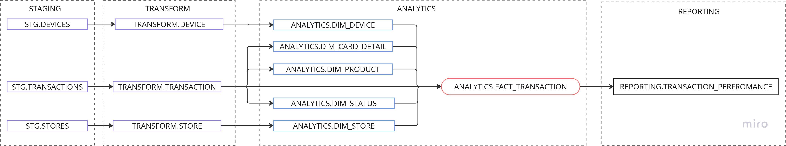

# Quick Start

- [Python Script](python_scripts)
- [DBT Models](models)
- [Output](analyses)

- Execution  
 Downaload & install [postgres](https://www.postgresql.org/download/)  
Download [Dbeaver](https://dbeaver.io/download/) for running sql queries and verifying the DB.  
Open Dbeaver and in sql code window create database named "sumup" to host all the data.
<pre><code>create database sumup;</code></pre>

  
If the new DB is not shown on the left side navigation pane, click new connection  
    "dbname": "sumup",
    "user": "postgres",
    "password": "admin",
    "host": "localhost",
    "port": 5432
Clone the repository from GitHub
<pre><code>git clone https://github.com/marzooqe/project_sumup.git
cd project_sumup </code></pre>
Place Excel files inside [source_data](source_data)
(The files shared is already placed inside. This step is optional to add more data of same source data for testing )
Create Python environment and install requirements
<pre><code>python -m venv dbt-env
dbt-env\Scripts\activate       (on Windows)</code></pre>
Run the complete pipline in one go. Triggers python script converting the files to csv -> chain executes next step running dbt build -> dbt test -> dbt run
<pre><code>pip install -r requirements.txt && python run_elt_pipeline.py</code></pre>

# Project SumUp
Welcome to the Project SumUp repository! This project implements ETL workflow using dbt & python, architecting raw transactional data into data model and actionable business insights.

🧭 Overview
This project simulates a modern data stack that is organised,clean, scalable which addresses data queries from analytics. It includes:

✅ Raw data ingestion from Excel files using python script

📂 Data architecture and modeling concept

🏗️ Data transformation into layers in dbt:
TRANSFORM (cleaned staging layer)
ANALYTICS (well-defined star dimensional models)
REPORTING (business focused OBT)

🔍 Data testing, linting, and CI/CD

💡 SQL file answering the data questions with output tables:

⚙️ Prerequisites
The following tools and setup is required to execute this project:

Tool	        Version	            Description
Python	        ≥ 3.9	            Runtime for py script, dbt and SQLFluff
dbt-core	    ≥ 1.5.0	            Data Build Tool for transformations
dbt-postgres	Matching version	Postgres adapter for dbt
PostgreSQL	    ≥ 13	            Local database
SQLFluff	    ≥ 2.0	            SQL linting and formatting
DBeaver         25.1.0              UI for querying and verification

Links to installation 

📂 Project Structure
    project_sumup/
    ├── models/
    │   ├── TRANSFORM/       # Cleaned raw data
    │   ├── ANALYTICS/       # Dimensional models (DIM_)
    │   ├── REPORTING/       # Fact tables, metrics
    │   ├── OUTPUT/          # Results from sql data queries
    │   ├── schema.yml       # Documentation & tests
    ├── seeds/               # Raw CSV data
    ├── macros/              # Custom dbt macros
    ├── .sqlfluff            # Linting configuration
    ├── dbt_project.yml      # Project metadata
    └── README.md            # 📄 You're here!

🚀 Execution Guide
1. 🔧 Set Up Environment
Clone the git to local device
open terminal 
# Create virtual environment
python -m venv dbt-env
dbt-env\Scripts\activate on Windows
# Install dependencies
pip install -r requirements.txt
pip install dbt-postgres sqlfluff sqlfluff-templater-dbt

2. 🛠️ Data ETL 

Add the raw data in a folder named raw data. 
execute the python scripts to load data to staging layer
convert_xlsx_tocsv.py
load_csv_to_postgres.py  OR copy the new csv files to dbt seed and run "dbt seed"

4. 🏗️ Run dbt Models
# Run all dbt models and tests
dbt build

dbt run 

dbt test

🧱 Data Model / Architecture

The diagram represents overall data flow and the architecure design of the modeling. The data is modeled based on star dimensional methodology and mainly comprises Facts and Dimension tables at the core of it. The star schema modeling is a classic method, earning its name based on how the data is organised, with a central fact table amd multiple dimension tables surrounding it. 

Architecture 
With the execution of python scripts data is available in base layer. This model is then developed in DBT core with github version control.  
The staging layer mirrors the raw source data without transformations business logic, One-to-one mapping with source systems, and it is designed as the fallback data source for uncorrupted raw data without BI intervention. This supports tracing debugging data issues and retro correction if needed.

Transformation Layer:
This layer mainly focuses on transformation of data to flat, filtered, and data type corrected structure.

Analytics Layer:
This schema is named Analytics and holds the star dimensional model. As seen in the above diagram the central fact transaction table is the core that contains the the metrics and the foreign keys to the related dimension tables. This methedology is what drives scalablity, optimised performance, denormalisation and accessibility. The fact table minimised to hold only keys along with incremental data load stable solution 

Reporting Layer
The data is modeled to the next layer called the Reporting Layer. This layer extracts OBTs by combining Facts and Dims to be directly used in a BI tool optimised for end users. This layer will be fully defined by business use cases and will have the pre-aggregations, so that it does not need to be in a BI visualisation tool. This layer is used by analyst for data to day request and in this assignment for querying the answers for the data pull questions.

🧪 Testing & Quality Checks
Implemented using: schema.yml-based tests (not_null, unique, etc.)
Custom tests: Integer format check, Timestamp validity, Row count comparisons between layers
SQLFluff linting (CI via GitHub Actions)

📤 Output / Results
After successful dbt build, the Postgres DB (sumup) will contain:
🚀 Clean tables ready for analysis structured in organised schemas
✅ Validated and type-checked data
🧾 Pre-joined reporting tables
🔍 Answers to the SQL questions already executed to OUTPUT schema
📚 Documentation (dbt docs generate + dbt docs serve)

