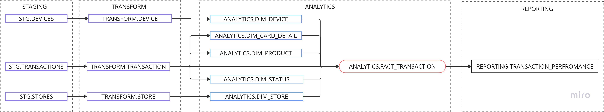

Senior Analytics Engineer: Take Home Challenge
Introduction
The goal of this technical test is to showcase an end-to-end
ELT
pipeline from a data source to any data warehouse using
Python
,
SQL
, and
dbt
with data models to answer the following questions:
Top 10 stores by transacted amount
Top 10 products sold
Average transacted amount per store typology and country
Percentage of transactions per device type
Average time for a store to perform its first 5 transactions
Deliverables
Please share the source code, data model design, and
SQL
queries that answer the above questions via a
public
Git repository.
Include a
README
file explaining your assumptions, design, and solution implementation details.
Your solution should be reproducible — i.e., the interviewer should be able to run your
dbt
project on their computer.
💡
Usage of pandas libraries and Python notebooks is not permitted. Please use (dbt-flavored) SQL for all data manipulations.
Senior Analytics Engineer: Take Home Challenge 1
Assumptions
Each customer has one or multiple stores, which are physical locations where their business happens. These stores are classified by different typologies.
We provide customers with different types of devices (1 to 5). These devices are hardware needed to perform transactions and are each tied to a specific store.
A transaction is a payment made using the provided devices. Currently, our devices only handle card payments in euros. These transactions are made to pay for products sold inside the store. Each product has a name and a SKU (stock keeping unit), which is unique.
Every day, our customers' customers visit their favorite stores to buy products and pay for them using the devices we provide.
We want to target customers who will use our devices efficiently and benefit most from our product. That's why we need to answer the above questions — to identify which stores, products, and devices are most efficient and to determine how long it takes for a store to adopt our devices. In order to solve this problem, we have provided the following three datasets in
.xlsx
format:
stores
devices
transactions
💡
The dataset supplied with this test contains only sample data. Your design and implementation should scale for larger volumes of data (millions to billions of records).
Senior Analytics Engineer: Take Home Challenge 2